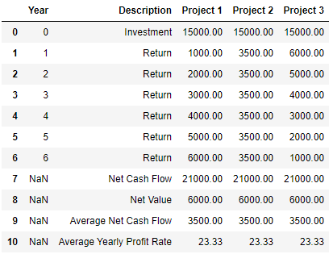
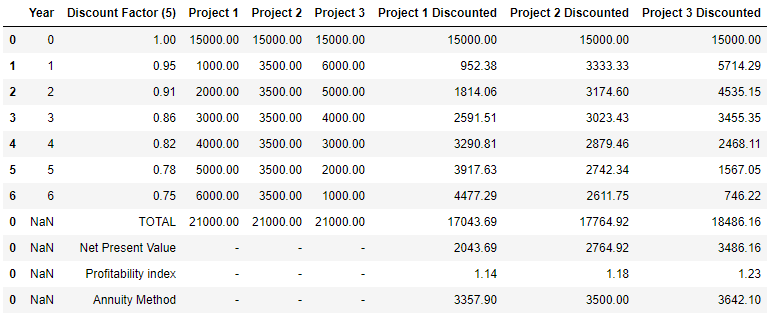
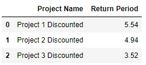
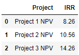

# HOW TO USE THE PROGRAM AND WHAT IS CAPABLE OF

## TABLE OF CONTENT'S
* [General-info](general-info)

## General Info

Courrently the program is in his beggining phases and the functionaility is limited, for now we have:

1. CashFlow Table assembly
2. The Discount CashFlow Table
3. Period of Return Checking
4. Indicators calculation:

    * Net Present Value (NPV)
    * Internal Return Rate (IRR)
    * Profitability index (PI)
    * Annuity Method

### CashFlow Table

These are the project's that we will compare, the first item in all of the list's is the project name , the second argument in the list is the investment amount and the other argument's are the expected cash flow in the future.

For example:

* Project 1 - is the name of the project
* 15000 - is the investment amount
* [1000, 2000, 3000, 4000, 5000, 6000] - are the expected future cash flow

 

    project_A = ['Project 1', 15000, 1000,  2000, 3000, 4000, 5000, 6000]

Now we will compare projects A, B, C, to do that we first need to feed the project variable into a list.

    project_A = ['Project A', 15000, 1000,  2000, 3000, 4000, 5000, 6000]
    project_B = ['Project B', 15000, 3500,  3500, 3500, 3500, 3500, 3500]
    project_C = ['Project C', 15000, 6000,  5000, 4000, 3000, 2000, 1000]

the "projects" variable store's our project's in a list, if you are mroe familiar with programming you view this as a nseted list.

    projects = [project_A, project_B, project_C]

From this data the program will generate the cashFlow Table, w
ich is a pandas DataFrame

In this stage we can preform Period Checking wich is essentialy a calculation when is the project return it's investment. 

In this case we won't do that because it does not represent a real world scenario, this type of checking will preform on the Discounted cash flow. This type of checking is more representative because in the Discounted Cash Flow we have the interest rate. 

Why a interest rate? If we have money we don't keep it under the bed, we keep it on our bank account's, where we earn a interest from the bank. 

So our money won't be worth the same today and in 1 year. This is why is important to incorporate the interest rate into a investment project.

To get a full view of our Cash Flow and other indicators we type:

    NPV, PC = evaulation.NetPresentValue(interestRate=5, periodChecking = True)

We asign two variables to this function call because we have two return's we we want the periodChecking.
The first will return a calculation of indicatirs and the second will preform Period Checking.

Financial indicators calculation

Period Checking table

And the last part of this process is the calculation of the internal return rate (IRR). 

    VIZ, IRR = evaulation.InternalReturnRate()

Like in the preavious function call we can assign two variables because we get two returns.

The first return is a table wich is a baseline for the graph where we represent the Net present value's.

We can represent this table with a graph wich gives us a better representation what is our IRR.

And the last image is our calculation of the IRR. Here we can see where our project's don't have any return and are making losse's.

 
 
 
 
 
 
 

## Refferences

The notebook of this example you can find in the main code base as:
    
    debuging.ipynb

IRR (https://www.investopedia.com/terms/i/irr.asp)

NPV (https://www.investopedia.com/terms/n/npv.asp)

Cash Flow (https://www.investopedia.com/terms/c/cashflow.asp)

